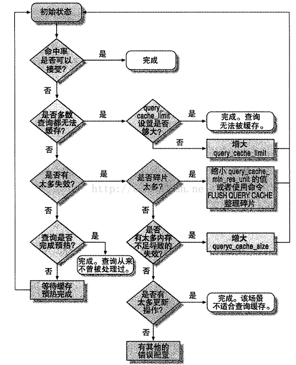

## 服务器性能剖析

### MySQL status日志

```
#!/bin/sh

INTERVAL=5
PASSWORD='-uroot -p123abc.'
PREFIX=$INTERVAL-sec-status
RUNFILE=/home/fanghao/Desktop/MySQLRunning
mysql -e 'SHOW GLOBAL VARIABLES' $PASSWORD >> mysql-variables
while test -e $RUNFILE; do
   file=$(date +%F_%I)
   sleep=$(date +%s.%N | awk "{print $INTERVAL - (\$1 % $INTERVAL)}")
   sleep $sleep
   ts="$(date + "TS %s.%N %F %T")"
   loadavg="$(uptime)"
   echo "$ts $loadavg" >> $PREFIX-${file}-status
   mysql -e 'SHOW GLOBAL STATUS' $PASSWORD >> $PREFIX-${file}-status &
   echo "$ts $loadavg" >> $PREFIX-${file}-innodbstatus
   mysql -e 'SHOW ENGINE INNODB STATUS\G' >> $PREFIX-${file}-innodbstatus  &
   echo "$ts $loadavg" >> $PREFIX-${file}-processlist
   mysql -e 'SHOW FULL PROCESSLIST\G' $PASSWORD >> $PREFIX-${file}-processlist &
   echo $ts
done
echo Existing because $RUNFILE does not exist
```

### MySQL 单条查询效率查看

#### 使用SHOW PROFILING
```
SET PROFILING = 1;

SELECT * FROM sakila.nicer_but_slower_film_list;

SET @query_id = 1;

SELECT STATE, SUM(DURATION) AS TOTAL_R,
	ROUND(
		100 * SUM(DURATION) /
			(SELECT SUM(DURATION)
             FROM INFOMATION_SCHEMA.PROFILING
             WHERE QUERY_ID = @query_id
		), 2) AS PCT_R,
	COUNT(*) AS CALLS,
    SUM(DURATION) / COUNT(*) AS RCALL
FROM INFOMATION_SCHEMA.PROFILING
WHERE QUERY_ID = @query_id
GROUP BY STATE
ORDER BY TOTAL_R DESC;
```

#### 使用SHOW STATUS

```
FLUSH STATUS;
SELECT * FROM sakila.nicer_but_slower_film_list;
SHOW STATUS WHERE Variable_name like 'Handler%' or Variable_name like 'Create%';

Handler_read_rnd_next 值比较大的话可能没走索引
```

### 单条查询问题还是服务器问题

#### 使用mysqladmin
```
mysqladmin -hhost -P3306 -uroot -p ext -i1 | awk '/Queries/{q=$4-qp;qp=$4}/Threads_connected/{tc=$4}/Threads_running/{printf "%5d %5d %5d\n", q, tc, $4}'
Queries 每秒查询数
Threads_connected 如果使用了线程池则基本不太变化
Threads_running 正在执行查询线程数
如果服务器有问题，Queries会下降，其他两个则会有尖刺现象
```

### 其他mysqladmin查看mysql服务器状态

```
mysqladmin -P3306 -uroot -p -h127.0.0.1 -r -i 1 ext |\
awk -F"|" \
"BEGIN{ count=0; }"\
'{ if($2 ~ /Variable_name/ && ((++count)%20 == 1)){\
    print "----------|---------|--- MySQL Command Status --|----- Innodb row operation ----|-- Buffer Pool Read --";\
    print "---Time---|---QPS---|select insert update delete|  read inserted updated deleted|   logical    physical";\
}\
else if ($2 ~ /Queries/){queries=$3;}\
else if ($2 ~ /Com_select /){com_select=$3;}\
else if ($2 ~ /Com_insert /){com_insert=$3;}\
else if ($2 ~ /Com_update /){com_update=$3;}\
else if ($2 ~ /Com_delete /){com_delete=$3;}\
else if ($2 ~ /Innodb_rows_read/){innodb_rows_read=$3;}\
else if ($2 ~ /Innodb_rows_deleted/){innodb_rows_deleted=$3;}\
else if ($2 ~ /Innodb_rows_inserted/){innodb_rows_inserted=$3;}\
else if ($2 ~ /Innodb_rows_updated/){innodb_rows_updated=$3;}\
else if ($2 ~ /Innodb_buffer_pool_read_requests/){innodb_lor=$3;}\
else if ($2 ~ /Innodb_buffer_pool_reads/){innodb_phr=$3;}\
else if ($2 ~ /Uptime / && count >= 2){\
  printf(" %s |%9d",strftime("%H:%M:%S"),queries);\
  printf("|%6d %6d %6d %6d",com_select,com_insert,com_update,com_delete);\
  printf("|%6d %8d %7d %7d",innodb_rows_read,innodb_rows_inserted,innodb_rows_updated,innodb_rows_deleted);\
  printf("|%10d %11d\n",innodb_lor,innodb_phr);\
}}'
```

#### 通过SHOW PROCESSLIST显示线程状态

```
mysql -uroot -hhost -P3306 -p -e 'SHOW PROCESSLIST\G' |grep State: | sort | uniq -c | sort -rn
```


## Schema与数据类型优化

InnoDB 使用bit存储NULL，对于稀疏数据（多数值为NULL，少数的列非NULL）会有很好的空间效率，不适用MyISAM

DECIMAL比浮点类型消耗更大，对于及要求小数运算精确性，又要求性能的，可以选取BIGINT，相应的从小数变整数即可

存储UUID，应该移除'-'符号，或者最好使用UNHEX()转换为16字节数字，并存储在BINARY(16)列中，检索用HEX()格式化十六进制数字

太多的列、太多的关联（<12个最好）、枚举alter消耗大（选用整数型做外键关联到字典表比较合适）

引用技术表可以创建多行，防止update一行出现锁竞争，使用RAND() * count来随机选择一行，最后使用SUM()取总数


```
INSERT INTO tablename(values, values) VALUES(values, values) ON DUPLICATE KEY UPDATE values = values;
```

要关联的表字段一致，可以使用USING获得更好的性能

ALTER TABLE需要注意ALTER COLUMN，MODIFY COLUMN，CHANGE COLUMN的合适类型

## 创建高性能的索引

Memory引擎具有哈希索引（针对索引列的所有内容哈希，所以不支持范围查询）
InnoDB会有一个自适应哈希索引，会根据使用比较频繁的索引，在B-Tree索引之上在建立哈希索引，用户无法控制但可以关闭

自定义哈希索引


```
SELECT id FROM table_name WHERE filed="" AND filed_crc=CRC32("")
CREATE TABLE table_name (
 .................
 ................
 filed_crc IN UNSIGNED NOT NULL DEFAULT 0,
)
```
缺点是需要手工维护这个索引列
此书中使用的是创建触发器，但我觉得在项目里面可以写到代码里面执行insert
不使用SHA1()/MD5()的原因是慢、并且会生成很长的字符串
但CRC32在数据很大的时候可能会冲突

### 高性能索引策略

* 独立的列（列不能参与计算）

* 前缀索引(优点：更小更快 缺点：无法order by, group by)

    ```
    select count(*) ... from ... group by .... order by ... desc limit ....;
    select count(*) .... LEFT(column, n) from ... group by .... order by ... desc limit ....;
    ```
    或者
    ```
    select count(distinct city)/count(*) from ...; # 计算出选择性
    ```
    计算取的前缀长度与选择性比较
    ```
    select count(distinct left(city, 3))/count(*) as sel3,
    	count(distinct left(city, 4))/count(*) as sel4,
    	count(distinct left(city, 5))/count(*) as sel5,
    	count(distinct left(city, 6))/count(*) as sel6,
    	count(distinct left(city, 7))/count(*) as sel7,
    	count(distinct left(city, 8))/count(*) as sel8 from ....;
    ```
    根据前缀长度创建索引
    ```
    alter table .... add key (column(length));
    ```

    后缀索引也有用途，MySQL无法反向索引，但可以把字符串反转后存储

### 选择合适的索引顺序

* 不考虑排序的话，选择性最高的放在前面(注意全局基数和选择性)
    ```
    select count(distinct columnA)/count(*) as columnA,
    	count(distinct columnB)/count(*) as columnB,
	count(*)
	from ....;
    ```

### Order By

* Order By子句和查找型查询的限制一样，需要满足索引最左前缀
  索引顺序与Order By字句完全一致，并且都是正序或者倒序时才能使用索引对结果排序
  关联查询则看order by引用的字段全部为第一个表
  看where和order by是否可以组成最左前缀，where条件中是常熟也可以

### 冗余和重复索引

* InnoDB主键已经包含在二级索引中

* 有时候需要建冗余索引来满足不同查询

* MySQL检查重复索引工具: pt-duplicate-key-checker，有时候INFORMATION_SCHEMA中有大量的表不适合来查询，外部工具比较合适

## 未使用的索引

* 打开userstates变量，运行一段时间查询INFORMATION_SCHEMA.INDEX_STATISTICS

### 支持多种过滤条件

* 如果某个列的选择性很低，但是使用场景特别多，例如sex，可以把sex加入到联合索引中，当查询用不到sex的时候，
  为了满足最左前缀，可以使用sex in('m', 'f')这种方式， 但列有太多值，这么做就不太合适

* in并不能太多，例如
    ```
    where columnA in('A', 'B', 'C')
    and columnB in('A', 'B', 'C', 'D')
    and columnC in('A', 'B')
    ```
  就会有4*3*2种组合，执行计划需要检查where字句中所有的24中组合

### 避免多个范围条件

* MySQL日期函数DATE_SUB(NOW(), INTERVAL 1 DAY)
* ORDER BY LIMIT数据太多的时候，业务方面可以限制翻页数量
  或者使用延时关联

    ```
    SELECT cols FROM TABLE INNER JOIN (
	SELECT primary_key_cols FROM TABLE
	WHERE ... ORDER BY LIMIT ..., ...
    ) AS ... USING(primary_key_cols);
    ```

### 维护索引和表

* CHECK TABLE/REPAIR TABLE
* 当存储引擎不支持REPAIR TABLE可以使用ALTER TABLE <tablename> ENGINE=<engine>; 这只是针对innodb引擎的一个例子

### 更新索引统计信息

* show index from table_name; Cardinality代表存储引擎估算索引列有多少个不同的取值

* 索引统计信息自动更新关闭，只能手动周期性的执行analyze table

### 减少索引和数据的碎片

  通过OPTIMIZE TABLE或者ALTER TABLE <tablename> ENGINE=<engine>;


## 查询性能优化

### 优化数据访问

* 查询不需要的记录
* 多变关联返回全部列
* 总是取除全部列，但如果多余的列做缓存，也不一定就是不好的
* 重复查询相同的数据


### 扫描行数

查询需要扫描大量数据，但是只返回少数行

* 索引覆盖扫描
* 改变库表结构，使用单独的汇总表
* 重写复杂查询

### 分解关联查询

* 缓存的效率更高
* 将关联查询重构拆散到应用程序中

## MySQL执行基础

### MySQL客户端/服务器通讯
#### 查询状态

* SHOW FULL PROCESSLIST

### 查询缓存

### 查询优化处理

* SHOW STATUS LIKE 'Last_query_cost';

  查询优化器分静态优化与动态优化

* MySQL中IN()中有大量数值，MySQL处理更快

* MySQL关联查询都是执行嵌套循环关联的操作

### MySQL执行计划

* EXPLAIN EXTENDED SQL; SHOW WARNINGS;即可查看重构出的查询

### 排序优化

* 内存排序和磁盘排序MySQL统一成为filesort，可以在explain看到为Using filesort

* 关联查询的时候，如果ORDER BY的字段都来自第一个表，那么在关联处理第一个表的时候就文件排序，可以看到Using filsort
  除此之外，都需要关联结束后文件排序，Using temporary;Using filesort。如果有Limit，也在排序之后Limit

### 关联子查询

* IN查询优化

    SELECT * FROM sakila.film
    WHERE film_id IN(
    	SELECT film_id FROM sakila.film_actor WHERE actor_id = 1
    );

    优化为

    SELECT film.* FROM sakila.film
    	INNER JOIN sakila.film_actor USING(film_id)
    WHERE actor_id = 1;

* 通过对比子查询/关联查询的QPS来决定，可将子查询改为关联查询或反之

### UNION限制

* UNION的字句根据LIMIT取部分数据，或者先排好序在合并结果，需要在子句中使用LIMIT来减少临时表的数据集

### MySQL无法利用多核来并行查询

### 松散索引

* EXPLAIN中是Using index for group-by


### MAX与MIN

* 有时候需要取最大值或者最小值的时候，看看是否可以根据主键判断，可以移除MIN或者MAX改用LIMIT


### 同一个表查询更新

  UPDATE tb1
  INNER JOIN(
    SELECT type, count(*) AS cnt
    FROM tb1
    GROUP BY type
  ) AS der USING(type)
  SET tb1.cnt = der.cnt


### COUNT

* 统计某个列值的数量，要求列值是非空的（不统计NULL）

* 统计结果集的行数

* MyISAM的count在没有where条件时非常快，比如说可以反向取值，用不加条件的count总数作为子查询
  使用反向（数量少的过滤项）来做查询


### 近似值

* 如果某些业务场景不需要很精确的值，可以使用explain中的优化器的估算行数

* 快速、精确、简单三者永远只能满足两个


### 优化关联查询

* 确保ON和USING子句上的列有索引，一般来说需要在关联顺序中第二个表的相应列创建索引

* 确保GROUP BY和ORDER BY中的表达式只涉及一个表的列

### 优化子查询

* 尽可能使用关联查询


### 优化GROUP BY和DISTINCT

* 都可以使用索引优化

* GROUP BY没有索引的时候，有两种策略，using template table或者using filesort

* 分组查询中SELECT直接使用非分组列不是good idea


### LIMIT分页优化

* 对于limit 1000, 20这种，可以尽可能使用索引覆盖扫描，而不是查询所有列，然后再做关联查询
    SELECT film.film_id, film_description
    FROM sakila.film
      INNER JOIN (
        SELECT film_id FROM sakila.film
	ORDER BY title LIMIT 50, 5
      ) AS lim USING(film_id)

* 或者是针对返回的主键查询
    SELECT * FROM sakila.rental
    WHERE rentail_id > 16303
    ORDER BY rental_id DESC LIMIT 20;


### 优化UNION

* 除非确实需要服务器消除重复行，否则一定要使用UNION ALL

### 避免重复查询刚刚更新的数据

```
UPDATE t1 SET lastUpdated = NOW() WHERE id = 1 AND @now := NOW();
SELECT @now;
```

* 变量赋值和取值发生在执行查询的同一阶段


### SELECT FOR UPDATE优化

```
BEGIN;
SELECT id FROM table
  WHERE
  LIMIT 10;

UPDATE table
  SET
  WHERE id IN ()
COMMIT;
```

但会造成查询阻塞，可以改成

```
SET AUTOCOMMIT = 1;
COMMIT;
UPDATE table
  SET
  WHERE
  LIMIT 10;
SET AUTOCOMMIT = 0;
SELECT id FROM table WHERE ;
```

## MySQL高级特性

### 分区表

#### 分区表原理

* SELECT: 分区层打开并锁住所有的底层表，优化器判断是否可以过滤部分分区，然后再调用对应的存储引擎接口访问各个分区数据

* INSERT: 分区层打开并锁住所有的底层表，确定哪个分区接收数据，在将记录写入对应底层表

* DELETE: 分区层打开并锁住所有的底层表，确定数据对应的分区，，从相应底层表进行删除

* UPDATE: 分区层打开并锁住所有的底层表，MySQL先判断数据在哪个分区，然后取出数据并更新，再判断更新后的数据应该放到
          那个分区，最后对底层表进行写入操作，并对原数据所在的底层表进行删除操作

#### 分区表注意的问题

* NULL值会使分区过滤无效

* 分区列和索引列不匹配(特别是在关联查询)

* 选择分区的成本很高(特别是范围分区，但是键分区和哈希分区就没有这种问题)

* 打开并锁住所有底层表的成本很高
    可以用批量操作的方式来降低单个操作的此类开销，批量插入或者LOAD DATA INFILE(InnoDB)，一次性删除多行

* 维护分区的成本很高


### 分区表查询优化

* 在WHERE条件中带入分区列，有时多余也要带上, 可以用EXPLAIN PARTITION查看优化器是否执行了分区过滤(partitions字段)

### 视图

* 合并算法（优先使用）

* 临时表算法

#### 查看视图查询使用什么算法

```
EXPLAIN SELECT * FROM view
```

查看select_type字段（PRIMARY-合并；DERIVED-临时表）
视图实现算法是视图本身属性，和查询语句无关，可以指定视图使用算法

```
CREATE ALGORITHM=TEMPTABLE VIEW v1 AS SELECT * FROM sakila.actor;
```
#### 可更新视图

* 如何视图定义中包含了GROUP BY， UNION，聚合函数，则无法更新

* 视图的查询语句可以是关联语句，但是更新的列比如来自同一个表

* 所有临时算法实现的视图无法被更新

* CHECK OPTION子句，表示任何通过视图更新的行，都必须符合视图本身的WHERE条件定义

#### 视图对性能的影响

* 可以使用视图基于列的权限控制，而不需要专门在系统中创建列权限，没有额外的开销

#### 查看创建视图语句

* SHOW CREATE VIEW

### 外键约束

* 外键会带来性能开销，但是如果为了确保两个相关表始终有一致数据，建议使用外键

* 外键只是限制值的话，ENUM会比较好


### 存储过程

* 对于一些小的查询，存储过程比较好，因为屏蔽了网络开销、解析开销和优化器开销

### 触发器

* 对于每一个表的每一个事件，最多只能定义一个触发器（INSERT，UPDATE，DELETE AFTER/BEFORE）
  即不能在AFTER INSERT中定义两个触发器

* MySQL只支持基于行的触发，只能针对一条记录(最大限制)

* 触发器不能一定保证更新的原子性(MyISAM不可以保证，InnoDB表上的触发器是在同一个事务中完成的，没问题)
  但在InnoBD上要注意MVCC，如果要实现类似于外键约束的功能，在BEFORE INSERT编写触发器检查别的表，而没有SELECT FOR UPDATE
  并发的更新语句会立即更新记录，造成数据不一致

### 查询缓存

* MySQL查询缓存对应用程序来说是透明的

* 查询本身，查询的数据库，客户端协议版本都会影响缓存是否命中

* 查询中NOW(), CURRENT_DATE()等查询不会缓存

* 如果希望执行一个带日期的查询，最好把日期提前计算好
    DATE_SUB(CURRENT_DATE, INTERVAL 1 DAY) -- Not cachedable
    DATE_SUB('2019-02-13', INTERVAL 1 DAY) -- Cachedable

#### 缓存未命中的可能

1. 查询语句没法被缓存（例如有不确定的函数）
2. MySQL尚未处理这个查询
3. 查询缓存用光

#### 大量缓存未命中

1. 缓存尚未预热
2. 查询语句未执行（ORM会好一些）
3. 缓存失效操作太多（缓存碎片，内存不足，数据修改）

* 通过SHOW STATUS LIKE '%cache%'中的Qcache_lowmen_prunes查看有多少次缓存失败是由于内存不足导致

* 通过Com_select和Qcache_inserts的相对值来判断缓存结构在失效前有没有被其他select使用

#### 配置维护查询缓存

* query_cache_type
    是否打开查询缓存

* query_cache_size
    查询缓存总内存空间，单位字节，1024倍数

* query_cache_min_res_unit
    查询缓存中分配内存块的最小单位

* query_cache_limit
    缓存的最大查询结果

* query_cache_wlock_invalidate
    表被其他链接锁住，是否还可以从查询缓存中返回结果，建议默认值


1. 减少碎片
    合理的query_cache_min_res_unit，取值可以参考(query_cache_size-Qcache_free_memory)/Qcache_queries_in_cache
    观察Qcache_free_blocks来观察碎片

2. 提高查询缓存的使用率
    如果没有缓存碎片问题，但是命中率低，还可能是查询缓存的内存空间太小导致

分析和配置查询缓存的流程图



#### InnoDB缓存

* 如果表上有锁，则无法通过缓存获取数据

#### 通用查询缓存优化

* 多个小表替代大表

* 批量写入

* 控制query_cache_size避免太大造成过期的操作导致服务器僵死

* 可以通过SELECT语句中SQL_CACHE和SQL_NO_CACHE来控制是否需要进行缓存

* 对于写密集型应用，可以直接禁用缓存

## 优化服务器配置

###查看MySQL当前使用配置文件地址

```
which mysqld
/usr/sbin/mysqld
/usr/sbin/mysqld --verbose --help | grep -A 1 'Default options'
```

对于服务器上只有一个MySQL实例很管用
每次修改后应该检查SHOW GLOBAL VARIABLES确认修改已经改变
