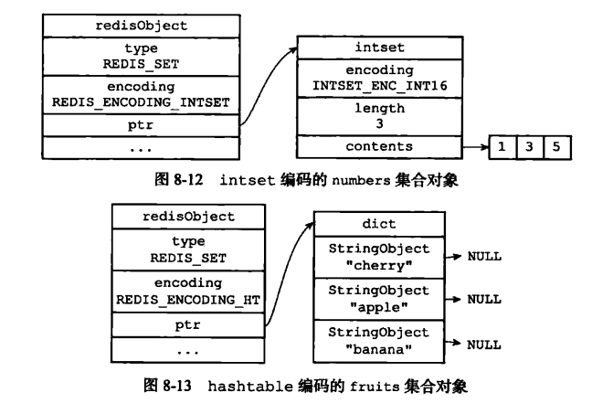
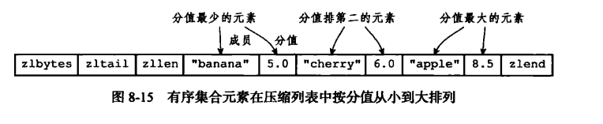
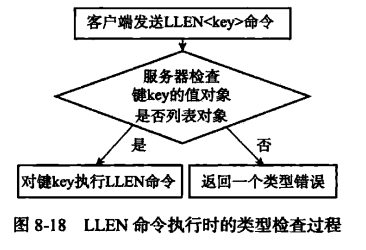
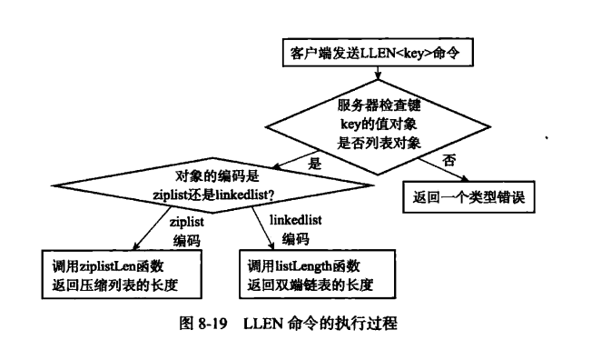
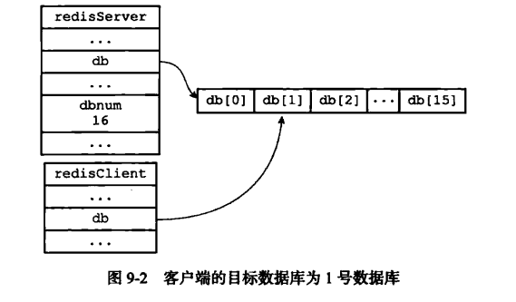
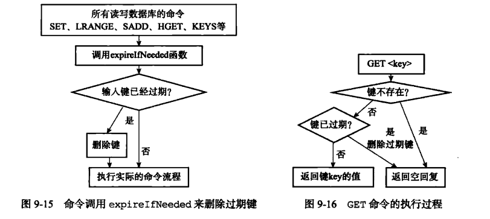

# Redis设计与实现

## 1. 简单动态字符串（SDS）

### 1.1 SDS区别C字符串

* SDS包括三部分（free，len，buf）, STRLEN的复杂度为O(1)，C字符串为O(n)

* 杜绝缓冲区溢出

* SDS通过未使用空间解除字符串长度和底层数组长度之间的关联, buf = 字符串数量 + 1 + free，达到空间预分配和惰性空间释放

* 空间预分配：用于字符串增加, SDS修改后的len<1MB，设置free=len，buf=len+free+1; len>1MB, free=1MB, buf=len+1MB(free)+1byte

* 惰性空间释放：用于字符串减少，修改了len与free之后，buf不会释放出多余的字节空间，为将来字符串增加做优化

## 2. 链表

Python实现（个人仿照书中c语言实例编写）

```
class Node:
    def __init__(self, data):
        self.data = data
        self.next = None


class LinkedList:
    def __init__(self):
        self.head = None
        self.tail = None
        self.length = 0

    def is_empty(self):
        return self.head is None

    def append(self, data):
        node = Node(data)
        if self.head is None:
            self.head = node
            self.tail = node
        else:
            self.tail.next = node
            self.tail = node
        self.length += 1

    def insert(self, idx, value):
        cur = self.head
        cur_idx = 0
        if cur is None:
            raise Exception('The list is an empty list')
        while cur_idx < idx - 1:
            cur = cur.next
            if cur is None:
                raise Exception('list length less than index')
            cur_idx += 1
        node = Node(value)
        node.next = cur.next
        cur.next = node
        if node.next is None:
            self.tail = node
        self.length += 1

    def remove(self, idx):
        cur = self.head
        cur_idx = 0
        if self.head is None:
            raise Exception('The list is an empty list')
        while cur_idx < idx - 1:
            cur = cur.next
            if cur is None:
                raise Exception('list length less than index')
            cur_idx += 1
        if idx == 0:
            self.head = cur.next
            cur = cur.next
            return
        if self.head is self.tail:
            self.head = None
            self.tail = None
            return
        cur.next = cur.next.next
        if cur.next is None:
            self.tail = cur

    def search(self, item):
        current = self.head
        found = False
        while current is not None and not found:
            if current.data == item:
                found = True
            else:
                current = current.next
        return found
```


### 2.1 Redis链表特性

* 双端，链表节点带有prev和next指针，获得某个节点前置节点和后置节点的复杂度都是O(1)

* 无环，表头的prev指针为NULL，表尾的next也为NULL

* 带表头指针和表尾指针，获取链头链尾的复杂度都为O(1)

* 带链表计数器长度，复杂度为O(1)

* 链表可以用于保存不同类型的值


## 3. 字典(Dict)

Redis字典是由哈希表实现的，一个哈希表里面有多个哈希节点，每个哈希表节点就保存了字典的一个键值对

### 3.1 字典实现


```
typedef struct dict {
    dictType *type;     //类型特定函数
    void *privdata;     //私有数据
    dictht ht[2];       //哈希表
    int rehashdx;      //rehash 索引,当 rehash 不在进行时,值为-1
} dict;

typedef struct dictht {
    dictEntry **table;      //哈希表数组
    unsigned long size;     //哈希表大小
    unsigned long sizemask; //用于计算索引值,
                            //总是等于 size - 1
    unsigned long used;     //哈希表已有节点数量
}  dictht;

typedef struct dictEntry {
    void *key;          //键
    union {             //值
        void *val;
        uint_64 u64;
        int64_t s64;
    } v;
    sturct dictEntry *next; //指向下个哈希表节点,形成链表
} dictEntry;
```

下的字典")

### 3.2 哈希算法

将一个新的键值存放入字典当中的时候，根据键计算出哈希值和索引值，再根据索引值，将包含新键值对的哈希表节点放入哈希表数组
的指定索引上


```
hash = dict -> type -> hashFunction(key);
index = hash & dict -> ht[x].sizemask;
```

### 3.3 解决键冲突

键冲突：当有两个或者更多键被分配到哈希表数组的同一个索引上

解决：每个哈希表节点都有一个next指针，通过next将哈希表节点组成单向链表，程序将新节点添加到链表的表头位置（O(1)）


### 3.4 Rehash

为了让哈希表的负载因子位置在一个合理的范围

1. 为字典ht[1]哈希表分配空间，其空间取决于要执行的操作和ht[0]当前包含的键值对数量

* 扩展：ht[1] = 第一个大于等于ht[0].used*2的$2^n

* 收缩：ht[1] = 第一个大于等于ht[0].used的$2^n

2. ht[0]中所有键值对rehash到ht[1]上，重新计算键的哈希值和索引值（哈希算法）

3. ht[0]全部迁移到ht[1]后，ht[0]为空表，释放ht[0]，将ht[1]设置为ht[0]，并在ht[1]创建新的空哈希表

### 3.5 哈希表的扩展与收缩

1. 服务器没有执行BGSAVE/BGREWRITEAOF命令，并且哈希表的负载因子大于等于1

2. 服务器目前正在执行BGSAVE/BGREWRITEAOF命令，并且哈希表的负载因子大于等于5

load_factor = ht[0].used / ht[0].size

哈希因子小鱼0.1时，自动进行收缩

### 3.6 渐进式Rehash

1. 为ht[1]分配空间，让字典同时持有ht[0],ht[1]

2. 字典维护rehashidx，0表示rehash开始(每转移一个键值对，rehashidx += 1, 最后转移完毕设置为-1，等待下一次rehash)

3. rehash期间，字典的delete，find，update会在两个哈希表上进行

4. 渐进式rehash期间，新增字典的键值对一律被保存在ht[1]


## 4. 跳跃表(zskiplist)

Redis中跳跃表的应用：实现有序集合键，集群节点中用作内部数据结构

```
typedef struct zskiplist {

    // 头节点，尾节点
    struct zskiplistNode *header, *tail;

    // 节点数量
    unsigned long length;

    // 目前表内节点的最大层数
    int level;

} zskiplist;

typedef struct zskiplistNode {

    // member 对象
    robj *obj;

    // 分值
    double score;

    // 后退指针
    struct zskiplistNode *backward;

    // 层
    struct zskiplistLevel {

        // 前进指针
        struct zskiplistNode *forward;

        // 这个层跨越的节点数量
        unsigned int span;

    } level[];

} zskiplistNode;
```

### 4.1 跳跃表的实现

zskiplist结构：

* header：指向跳跃表的表头节点

* tail：指向跳跃表的表尾节点

* level：记录目前跳跃表内层数最大的那个节点的层数（expect表头节点）

* length：记录跳跃表的长度，即跳跃表目前包含节点的数量（expect表头节点）

* 层（level）: zskiplistNode的每个层，包含forward指针和span跨度

* backward: 节点中个的BW表示标记几点的后退指针，用于表尾想表头遍历时使用

* 分值(score)：节点按各自保存的分值从小打到排序

* 成员对象(obj)：节点所保存的成员对象


通过header和tail指针，程序定位表头节点和表尾节点的复杂度为O(1)


## 5. 整数集合(intset)

集合键的底层实现之一（当集合只包含整数值元素并且元素数量不多时）

```
typedef struct intset {

    // 编码方式
    unint32_t encoding;

    // 集合包含的元素数量
    unint32_t length;

    // 保存元素的数组
    int8_t contents[];

} intset;
```

* contents数组是整数集合的底层实现，整数集合的每个元素都是contents数组的一个数据项（item），并且从小大到排列
* length = len(contents)
* encoding决定contents真正类型

### 5.1 升级

新元素添加到intset中，并且新元素的类型比intset所有元素的类型都要长，要先upgrade（复杂度O(N)）

1) 根据新元素类型扩展intset整数集合底层数组的空间大小
2) 底层数组所有元素转换成新元素相同的类型，转换过程需要位置底层数组的有序性质不变（首先移动后面的元素）
3) 新元素添加到底层数组

### 5.2 降级

整数集合不支持降级操作


## 6. 压缩列表（ziplist）

ziplist是列表键和哈希键的底层实现之一（包含少量列表项/键值对，并且每个列表项/键值对的键和值都是小整数值或者短字符串）

### 6.1 组成

* zlbytes: 压缩列表占用的内存字节数
* zltail: 压缩列表尾节点距离压缩列表起始地址有多少字节，无须遍历整个压缩列表就可以确定表尾节点的地址
* zllen: 压缩列表的节点数
* entryX: 列表节点
* zlend: 标记压缩列表的末端

### 6.2 压缩列表节点构成

可以保存一个字节数组或者一个整数值

* previous_entry_length: 记录压缩列表前一个节点的长度（可以根据当前节点的起始地址来计算前一个节点的起始地址，完成从表尾节点想表头节点遍历， 节点长度<254，用1字节长度来保存，>=254用5字节来保存）
* encoding: 记录content属性所保存数据的类型与长度
* content：保存节点的值（字节数组或者整数）

### 6.3 连锁更新

节点e1,e2,e3....所有节点的长度都在250-253，new为254，现在将new放置到表头节点，需要连续多次空间扩展和重新分配（删除节点也可能引起连锁更新）

重新分配空间的最坏复杂度为O(N)，连锁更新的最坏复杂度为O(N^2), 但是连锁更新造成的性能问题几率很低，所以ziplistPush命令的平均复杂度为O(N)

ziplistPush, ziplistInsert, ziplistDelete, ziplistDelteRange都可能引起连锁更新


## 7 对象

### 7.1 对象的类型和编码

Redis新建键值对时，会创建至少两个对象（键对象，值对象）

```
typedef struct redisObject {
    // 类型
    unsigned type:4;
    // 编码（使用什么数据结构）
    unsigned encoding:4;
    // 指向底层实现数据结构的指针
    void *ptr;
    // ...
} robj;
```

键总是一个字符串对象，而值则可以使字符串对象，列表对象，哈希对象，集合对象或者有序集合对象的其中一种（type命令查看类型）

```
/* Objects encoding. Some kind of objects like Strings and Hashes can be
 * internally represented in multiple ways. The 'encoding' field of the object
 * is set to one of this fields for this object. 
 */
#define OBJ_ENCODING_INT      /* Encoded as integer */ 整数
#define OBJ_ENCODING_RAW     /* Raw representation */ 简单动态字符串
#define OBJ_ENCODING_EMBSTR  /* Embedded sds string encoding */ embstr编码的简单动态字符串
#define OBJ_ENCODING_HT       /* Encoded as hash table */ 字典
#define OBJ_ENCODING_ZIPLIST  /* Encoded as ziplist */ 压缩列表
#define OBJ_ENCODING_LINKEDLIST  /* Encoded as linked list of ziplists */ 双端列表
#define OBJ_ENCODING_INTSET   /* Encoded as intset */ 整数集合
#define OBJ_ENCODING_SKIPLIST   /* Encoded as skiplist */ 跳跃表
```

不同类型和编码的对象

|类型|编码|对象|
|:---- |:---- |---- |
|REDIS_STRING|REDIS_ENCODING_INT|整数值实现的字符串对象|
|REDIS_STRING|REDIS_ENCODING_EMBSTR|embstr编码的SDS实现的字符串对象|
|REDIS_STRING|REDIS_ENCODING_RAW|SDS实现的字符串对象|
|REDIS_LIST|REDIS_ENCODING_ZIPLIST|压缩列表实现的列表对象|
|REDIS_LIST|REDIS_ENCODING_LINKEDLIST|双端列表实现的列表对象|
|REDIS_HASH|REDIS_ENCODING_ZIPLIST|压缩列表实现的哈希对象|
|REDIS_HASH|REDIS_ENCODING_HT|字典实现哈希对象|
|REDIS_SET|REDIS_ENCODING_INTSET|整数集合实现的集合对象|
|REDIS_SET|REDIS_ENCODING_HT|字典实现的集合对象|
|REDIS_ZSET|REDIS_ENCODING_ZIPLIST|压缩列表实现的有序集合对象|
|REDIS_ZSET|REDIS_ENCODING_SKIPLIST|跳跃表和字典实现的有序集合对象|

```
reids > SET msg "hello world"
OK

redis > OBJECT ENCODING msg
"embstr"
```

### 7.2 字符串对象

字符串对象的编码可以是int，raw或者embstr

embstr编码的字符串对象在执行命令时，产生的效果和raw编码的字符串对象执行命令时产生的效果是相同的

使用embstr的优点：

* 创建embstr字符串所需的内存分配次数从raw编码的两次降低为一次
* 释放embstr编码的字符串对象只需要调用一次内存释放函数
* embstr编码的字符串对象数据都保存在一块连续的内存里，可以更好地利用缓存

### 7.2.1 编码转换

int编码的字符串，使用一些命令使这个对象不再是整数值，而是一个字符串值，编码会从int变为raw

```
redis > SET number 10086
OK

redis > OBJECT ENCODING number
"int"

redis > APPEND number " is a good number!"
(integer) 23

redis > OBJECT ENCODING number
"raw"
```

embstr编码的字符串无任何相应的修改程序（只有int和raw有），所以对embstr做修改时，它会转换为raw，然后在执行修改命令，所以embstr编码的字符串在执行修改命令后，总会变成raw编码的字符串对象


### 7.3 列表对象

列表对象的编码可以是ziplist或者linkedlist

使用ziplist的条件（必须都满足以下两个条件）：

* 列表对象保存的所有字符串元素的长度都小于64字节
* 列表对象保存的元素数量小于512个
* 可以通过list-max-ziplist-value和list-max-ziplist-entries修改上限

### 7.4 哈希对象

哈希对象的编码可以是ziplist或者hashtable

使用ziplist

```
redis > HSET profile name "Tom"
(integer) 1

redis > HSET profile age 25
(integer) 1

redis > HSET profile career "Programmer"
(integer) 1
```

| zlbytes | zltail | zllen | "name" | "Tom" | "age" | 25 | "career" | "Programmer" | zlend |

使用hashtable

* 字典的每个键都是一个字符串对象，对象中保存了键值对的键
* 字典的每个值都是一个字符串对象，对象中保存了键值对的值

#### 7.4.1 编码转换

哈希对象同时满足以下两个条件时，使用ziplist编码

* 哈希对象保存的所有键值对的键和值的字符串长度都小于64字节
* 哈希对象保存的键值对数量小于512
* * 可以通过hash-max-ziplist-value和hash-max-ziplist-entries修改上限

### 7.5 集合对象

集合对象的编码可以是intset或者hashtable



hashtable实现集合对象时，字典的每一个键都是一个字符串对象，每个字符串包含了一个集合对象，字典的值全部设为NULL

#### 7.5.1 编码转换

集合对象同时满足以下两个条件时，使用intset编码

* 集合对象保存的所有元素都是整数值
* 集合对象保存的元素数量不超过512
* 可以通过set-max-intset-value修改上限

### 7.6 有序集合对象

有序集合对象编码可以是ziplist或者skiplist



有序集合需要同时使用skiplist和dict来实现

#### 7.6.1 编码转换

当有序集合对象可以同时满足以下两个条件时，对象使用ziplist编码（不满足使用skiplist）

* 有序集合保存的元素数量小于128个
* 有序集合保存的所有元素成员的长度都小于64字节
* 可以通过zset-max-ziplist-entries和zset-max-ziplist-value修改

### 7.7 类型检查与命令多态

Redis对于操作键的命令分为两种类型

1. 对任何类型的键执行:DEL,EXPIRE,RENAME,TYPE,OBJECT
2. 只能针对特定类型的键执行，比如SET、GET、APPEND、STRLEN只能对字符串键执行

#### 7.7.1 类型检查

通过redisObject的type属性来判断



#### 7.7.2 命令多态




### 7.8 内存回收

引用计数技术实现内存回收机制

```
typedef struct redisObject {
    // 引用计数
    int refcount;
    // ...
} robj;
```

### 7.9 对象共享

引用计数属性还带有对象共享的作用（⚠️受限于CPU时间的限制，Redis只针对包含整数值的字符串对象进行共享）

Redis中多个键共享同一个值对象需要执行以下两个步骤

1. 将数据库的键的值指针指向一个现有的值对象
2. 将被共享的值对象的引用计数+1

所以值对象相同时，共享对象机制对于节约内存非常有帮助（目前Redis会在初始化服务器时创建1W个字符串对象，包含了从0-9999所有整数值）

不止字符串键可以使用，在数据结构中嵌套了字符串对象的对象（linkedlist编码的列表对象、hashtable编码的哈希对象、hashtable编码的集合对象，zset编码的有序集合对象）都可以使用共享对象

### 7.10 对象的空转时长

记录对象最后一次被命令访问的时间

```
typedef struct redisObject {
    // ...
    unsigned lru:22;
    // ...
} robj;
```

OBJECT IDLETIME可以打印出给定键的空转时长，OBJECT IDLETIME不会修改对象的lru属性

通过maxmemory选项可以将空转时长较高的部分键优先被服务器释放，回收内存


## 8 数据库

### 8.1 服务器中的数据库

```
struct redisServer {
    // ...
    // 一个数组，保存着服务器中所有的数据库
    redisDb *db;
    // 服务器的数据库数量
    int dbnum;
    // ...
} robj;
```

dbnum由服务器配置的database决定，默认是16

### 8.2 切换数据库

```
typedef struct redisClient {
    // ...
    redisDb *db;
    // ...
} redisClient;
```

redisClient.db指针指向redisServer.db数组中的一个元素（客户端的目标数据库）



⚠️注意多数据库操作时选择正确的数据库

### 8.3 数据库的键空间

```
typedef struct redisDb {
    // ...
    // 数据库键空间，保存着数据库中所有键值对
    dict *dict;
    // ...
} redisDb;
```

数据库键空间是一个字典，所以所有针对数据库的操作，都是通过键空间字典进行操作实现的

#### 8.3.1 添加新键

将一个新键值对添加到键空间字典中，键为字符串对象，值为任意一个类型的Redis对象

#### 8.3.2 删除键

键空间删除键所对应的键值对对象

#### 8.3.3 更新键

#### 8.3.4 键值对取值

### 8.4 设置键的生存时间活过期时间

EXPIRE/PEXPIRE可以设置键的TTL

SETEX可以设置一个**字符串键**的同时为键设置过期时间

#### 8.4.1 设置过期时间

* EXPIRE: 生存时间设置为秒
* PEXPIRE: 生存时间设置为毫秒
* EXPIREAT： 过期时间设置为timestamp所指定的秒数时间戳
* PEXPIREAT： 过期时间设置为timestamp所指定的毫秒数时间戳

都是基于PEXPIREAT命令实现

#### 8.4.2 保存/移除过期时间

```
typedef struct redisDb {
    // ...
    // 过期字典，保存着键的过期时间
    dict *expires;
    // ...
} redisDb;
```

使用PEXPIREAT命令，服务器会在数据库的过期字典中关联给定的数据库键和过期时间

使用PERSIST命令可以移除一个键的过期时间

#### 8.4.3 计算并返回剩余生存时间

* TTL:返回键的剩余生存时间
* PTTL:返回键的剩余生存时间（毫秒）

#### 8.4.5 过期键的判定

1. 检查给定键是否存在于字典中：如果存在，那么取得键的过期时间
2. 检查当前UNIX时间戳是否大于键的过期时间：如果是的话，那么键已经过期，否则未过期

### 8.5 过期键删除策略

* 定时删除：通过定时器（timer），在键过期时间来临时，立即删除（主动）
* 惰性删除：从键空间获取键的时候，检查是否过期（被动）
* 定期删除：每隔一段时间执行一次检查，删除多少过期键以及检查多少数据库由算法决定（主动）

#### 8.5.1 定时删除

对内存友好，对CPU压力较大，对于让服务器创建大量定时器来实现实时删除策略，现阶段不太现实

#### 8.5.2 惰性删除

对CPU友好，但是会存在过期键不被删除，内存不被释放的问题，对内存不友好

#### 8.5.3 定期删除

折中方案，服务器必须根据情况，合理的设置删除操作的执行时长和执行频率

### 8.6 Redis的过期键删除策略

实际使用惰性删除和定期删除两种策略

#### 8.6.1 惰性删除策略的实现

